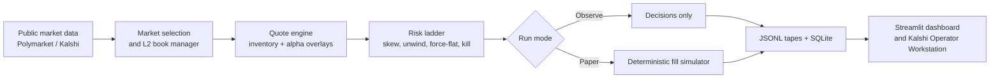
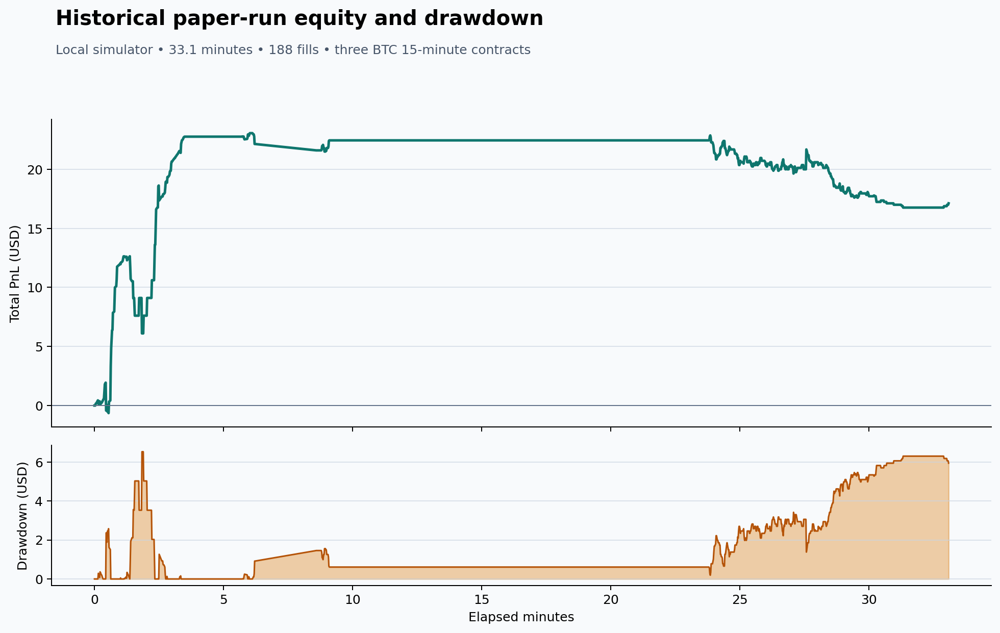
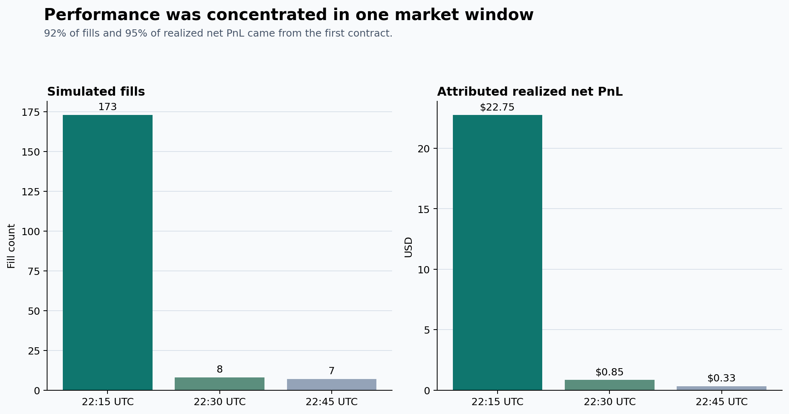

# Prediction-Market Market Maker

> A research and operator system for building, observing, and testing an
> inventory-aware market maker on binary prediction markets.

This is the project I built to explore the engineering behind automated market
making: live order-book ingestion, quote generation, paper execution, risk
controls, experiment telemetry, and the operator tools needed to understand
what the system is doing.

The project combines the trading runtime with the operator view: market
selection, quoting, paper execution, risk handling, experiment data, and the
tools to inspect each decision after a run.

## Recruiter quick read

| What | Evidence |
| --- | --- |
| Problem | Turn noisy public prediction-market books into controlled two-sided quotes without losing track of inventory, fees, or operational risk. |
| Core build | Python market-making runtime with L2 book management, paper broker, quote/risk engines, JSONL + SQLite telemetry, and a Streamlit dashboard. |
| Operator build | A local React/Tauri Kalshi Operator Workstation with a FastAPI control plane for paper runs, decisions, fills, and validated risk commands. |
| Quality | **419 automated tests** pass; the Operator Workstation production build succeeds. |
| Research result | Best committed simulator run: **188 fills**, **$23.93 realized net PnL**, **$17.11 ending total PnL**, and **$6.53 max drawdown**. |
| Current evidence | The saved result spans three BTC 15-minute windows and is presented as paper-trading research. |

## What I built



The system is organized around four practical layers:

1. **Market intelligence** — discovers short-horizon BTC, ETH, SOL, and XRP
   markets, maintains L2 books, and filters candidates by tradability,
   spread, liquidity, and timing.
2. **Execution research** — produces inventory-aware two-sided quotes and
   runs a deterministic paper broker with queue, visible-depth, fee, staleness,
   turnover, and markout assumptions.
3. **Risk and controls** — sizes positions conservatively and drives explicit
   `SKEW`, `UNWIND`, `FORCE_FLAT`, and kill-switch behavior instead of treating
   PnL as the only control signal.
4. **Operator experience** — records every cycle, decision, order, fill, and
   PnL event so a human can inspect the reason for a market choice or risk
   transition rather than blindly trust a bot.

## What is inside

- **Deterministic paper execution:** a reusable simulator models resting-order
  wait time, visible queue depth, fill eligibility, fees, and inventory PnL.
- **Risk is first-class:** per-order, per-market, per-event, and daily limits
  feed a clear exit ladder, with cancel-on-shutdown behavior in the legacy live
  adapter.
- **Reproducible evidence:** raw JSONL tapes and SQLite telemetry support
  dashboards, reports, regression tests, and the committed paper-trading EDA.
- **Kalshi-first operator lane:** the repo includes market selection, fee
  modeling, execution bridging, calibration harnesses, and a local paper-only
  workstation focused on one active BTC market at a time.
- **Evidence workflow:** JSONL tapes, SQLite telemetry, charts, and tests keep
  experiments reviewable and reproducible.

## Paper-run plots

These figures come from the saved historical paper run. They are generated by
[`scripts/analyze_paper_runs.py`](scripts/analyze_paper_runs.py) from committed
JSONL tapes, with the accounting logic covered by
[`tests/scripts/test_analyze_paper_runs.py`](tests/scripts/test_analyze_paper_runs.py).

| Historical paper-run metric | Result |
| --- | ---: |
| Runtime | 33.1 minutes |
| BTC 15-minute contracts | 3 |
| Simulated fills | 188 |
| Realized net PnL | $23.93 |
| Ending total PnL | $17.11 |
| Maximum drawdown | $6.53 |
| Modeled turnover | $1,331.10 |





The saved run shows how the system behaved across three BTC 15-minute windows:
**92% of fills and 95% of realized net PnL came from the first window.**

Read the full, reproducible analysis: [Paper-Trading EDA](docs/analysis/PAPER_TRADING_EDA.md).

## Run it locally

Python 3.11+ is recommended.

```bash
git clone https://github.com/lovefrosty/Polymarket-Trading-Bot.git
cd Polymarket-Trading-Bot
python3 -m venv .venv
source .venv/bin/activate
python -m pip install -r requirements.txt
python -m pytest -q
```

Observe a current BTC market without submitting or simulating orders:

```bash
python scripts/run_core_mm.py \
  --mode OBSERVE \
  --runtime-root tmp/observe-demo \
  --duration-secs 120 \
  --symbol BTC
```

Run a paper experiment against public book data:

```bash
python scripts/run_core_mm.py \
  --mode PAPER \
  --runtime-root tmp/paper-demo \
  --run-name "Local paper demo" \
  --duration-secs 300 \
  --symbol BTC \
  --trade-size 5 \
  --max-size 25
```

Rebuild the saved-run charts and metrics:

```bash
python scripts/analyze_paper_runs.py
```

## Kalshi Operator Workstation

The `operator_app/` is a React/Tauri desktop operator surface backed by a local
FastAPI service. It helps an operator start **paper** runs, inspect selection
and fill rationale, see after-fee risk data, and issue validated stop or kill
commands.

```bash
python scripts/run_operator_service.py

cd operator_app
npm ci
npm run dev
```

The service binds to `127.0.0.1:8765` by default and deliberately launches
managed runtimes in `PAPER` mode. The point is operational understanding, not
one-click live trading. See the [operator checklist](docs/OWNER_UNDERSTANDING_CHECKLIST.md).

## What I would build next

| Priority | Why it matters |
| --- | --- |
| Collect a fixed Kalshi BTC paper dataset | Needed for independent-window returns, downside distribution, and parameter sensitivity. |
| Stress paper fills and current fees | A profitable backtest is unhelpful if queue position, cancels, or fee assumptions are flattering it. |
| Port the Polymarket adapter to CLOB V2 | The checked-in Polymarket live path uses the retired V1 client and remains disabled until a V2 migration and full revalidation. |
| Run a separately approved tiny canary | Only after the paper gate, fee reconciliation, and operator workflows are independently reviewed. |

For the Polymarket migration boundary, see the [official CLOB V2 migration guide](https://docs.polymarket.com/v2-migration).

## Repository guide

| Path | Purpose |
| --- | --- |
| [`core_mm/`](core_mm/) | Active market-making, execution, risk, telemetry, and Kalshi integration. |
| [`scripts/run_core_mm.py`](scripts/run_core_mm.py) | Main OBSERVE/PAPER runtime; contains historical LIVE wiring. |
| [`dashboard/`](dashboard/) | Streamlit research and operator dashboard. |
| [`operator_app/`](operator_app/) | React/Tauri Kalshi Operator Workstation. |
| [`scripts/analyze_paper_runs.py`](scripts/analyze_paper_runs.py) | Reproducible EDA and chart generation. |
| [`docs/`](docs/) | Go-live criteria, operator guidance, experiments, and analysis. |
| [`tests/`](tests/) | Regression coverage for execution, risk, telemetry, dashboards, and scripts. |
| [`legacy/`](legacy/) | Earlier implementation retained for provenance, not the primary runtime. |

## Collaborate

Interested in market microstructure, trading systems, or research tooling? Open
an issue with a bounded experiment or submit a pull request with the assumption
being changed, the evidence source, and the tests run. The detailed contribution
guide is in [CONTRIBUTING.md](CONTRIBUTING.md).

High-value contribution areas: CLOB V2 migration, point-in-time datasets,
queue/latency sensitivity, fee and rebate accounting, reproducible evaluation,
and operator reliability.

## Safety and research boundary

This is research and educational software, not financial, legal, or investment
advice. Prediction-market trading can lose the full amount at risk, and
simulated performance can differ materially from live performance.

Do **not** run the current Polymarket `LIVE` path in production. It uses a
retired CLOB V1 client and needs a CLOB V2 migration, current fee handling, and
fresh end-to-end validation first. Never commit a wallet key, API credential,
passphrase, seed phrase, or funded `.env` file.
